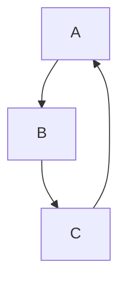
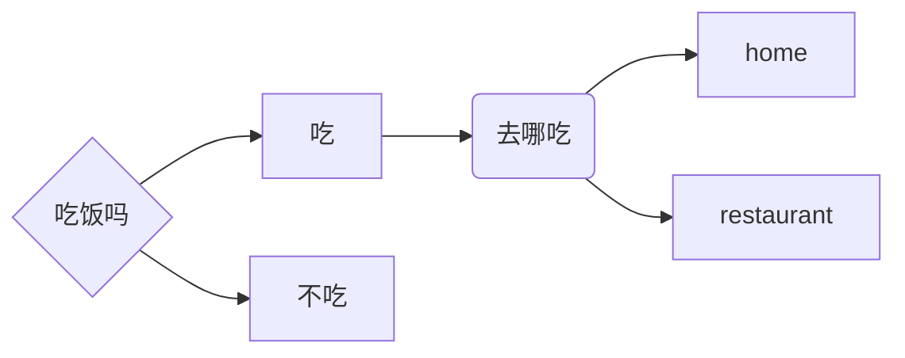
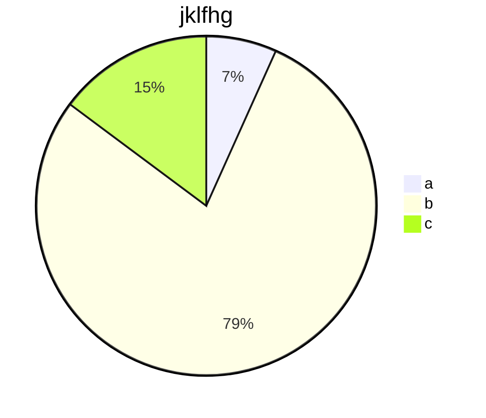

# Typora教程

# 1 下载Typora
进入Typora官网，点击download，可以下载mac,windows,Linux三种版本的Typora。
进入Typora后，点击文件-偏好设置，在“Markdown”中勾选“上标”、“下标”、“高亮”、“图表”。
在“视图”中切换“源代码模式”可以切换成已渲染过后的界面或源代码界面。

# 2 标题
```
# 一级标题
## 二级标题
### 三级标题
#### 四级标题
##### 五级标题
###### 六级标题
```
# 一级标题
## 二级标题
### 三级标题
#### 四级标题
##### 五级标题
###### 六级标题
==最多只有六级标题==


# 3 代码

## 代码块

```
“```+编程语言”
```
```java
void main(string[]){
    
}
```

## 行内代码

``` 
“`+文字+`”
```

`java`

`Python`

# 4 字体

```
**文字**
```
**加粗文字**

```
*文字*
```
*斜体文字*

```
***文字***
```
***斜体加粗文字***

```
~~文字~~
```
~~删除线~~ （==注意使用英文字符==）

```
==文字==
```

==高亮==

```
^文字^
面积 m^2^
```

我是^上标^

面积 m^2^

```
~文字~
水 H~2~O
```
我是~下标~ （==注意使用英文字符==）

水 H~2~O

```
<u>文字</u>
或输入文字后，快捷键“Ctrl+u”生成下划线
```

我是，<u>下划线</u>

# 5 列表
## 无序列表
```
+ a
+ b
  + c
    + d
或者使用“*”，“-”
```
+ a
+ b
  + c
    + d
## 有序列表
```
1. a
2. b
3. c
4. d
```
1. a
2. b
3. c
4. d

# 6 表格

```
使用 | 分格不同列，使用 - 分隔表头和其他行
创建表格输入:
name|nationality
:---(左对齐)|:---:(居中对齐)
Jasmine|Chinese
Constance|American
```
*适用于小表格*

| name      | nationality |
| :-------- | :---------: |
| Jasmine   |   Chinese   |
| Constance |  American   |

或
```
使用快捷键Ctrl+t插入表格
```
|  1   |  2   |  3   |  4   |  5   |
| :--: | :--: | :--: | :--: | :--: |
|      |      |      |      |      |
|      |      |      |      |      |
|      |      |      |      |      |
|      |      |      |      |      |


# 7 引用

```
>a
>>b
>>>c
>>>>d（嵌套引用）
```
>引用
>>b
>>>c
>>>
>>>>d
>>>>

# 8 分割线
```
***+回车
或
-------+回车
```
------------------------

***

# 9 超链接

## 外部跳转

```
[link text](link)
然后使用快捷键“Ctrl+点击”
```

[跳转到Typora官网](https://typora.io/)

## 内部跳转

```
[跳转](#某标题)
```

[跳转到标题](#2 标题)

## 自动链接

```
<https://typora.io/>
```

<https://typora.io/>

# 10 图片

```

```


# 11 画图

*利用“mermaid”库*

## （1）流程图（Graph）

### 方向描述：

| 用词 | 含义     |
| ---- | -------- |
| TB   | 从上到下 |
| BT   | 从下到上 |
| RL   | 从右到左 |
| LR   | 从左到右 |

例如

```
graph TB;
A-->B
B-->C
C-->A
选择语言为"mermaid"
```




### 节点形状：

| 表达式       | 节点名称     | 说明           |
| ------------ | ------------ | -------------- |
| name[文字]   | 矩形节点     | 流程中某一环节 |
| name(文字)   | 圆角矩形节点 | 开始、结束     |
| name((文字)) | 圆形节点     | 连接           |
| name{文字}   | 菱形节点     | 判断、决策     |
| id>文字]     | 右向旗帜节点 |                |



*点击图片查看代码*

### 连线：

| 连线形式 | 表达式         |
| -------- | -------------- |
| 实线箭头 | -->/--文字-->  |
| 实线     | ---/--文字---  |
| 虚线箭头 | -.->/-.文字.-> |
| 虚线     | -.-/-.文字.-   |

### 子图表：

```
subgraph name
...
end
```

## (2)饼图

```
pie
  title jklfhg
  "a":34
  "b":398
  "c":75
```



[更多图表种类点击](http://support.typora.io/Draw-Diagrams-With-Markdown/)

# 12 数学公式


### 行内公式

```
$公式$
```

==先打出2个“$”后，在中间输入公式==

因此,$A+B=C$

### 行间公式

```
$$+回车
在框中输入公式
```

$$
A+B=C
$$
### 上角标
```
2的5次方
$2^5$
```
$2^5$

### 下角标

```
回归方程
$y=x^2_1+x^2_2+e_i$
```

$y=x^2_1+x^2_2+e_i$

### 求和

```
$\sum_{i=0}^8 x_i+y_i$
```

$$\sum_{i=0}^8 x_i+y_i$$

```
$\sum\limits_{i=0}^8$
```

$\sum\limits_{i=0}^8$

###  连乘

```
$\prod\limits_{i=0}^n$
```

$\prod\limits_{i=0}^n$

### 省略号

```
$k=1,2,\cdots,n$
$A\quad B$
```

$k=1,2,\cdots,n$

$A\quad B$

### 乘

```
$a\cdot b$
$a\times b^2$
```

$a\cdot b$ 

$a\times b^2$

### 分式

```
$\frac{2}{5}$
$\dfrac{2}{5}$
$x_{1,2}=\dfrac{-b\pm \sqrt{b^2-4ac}}{2a}$
```

$\frac{2}{5}$ $\dfrac{2}{5}$

$x_{1,2}=\dfrac{-b\pm \sqrt{b^2-4ac}}{2a}$

